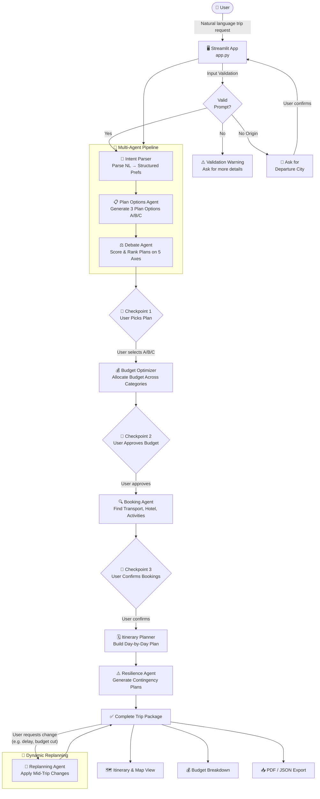
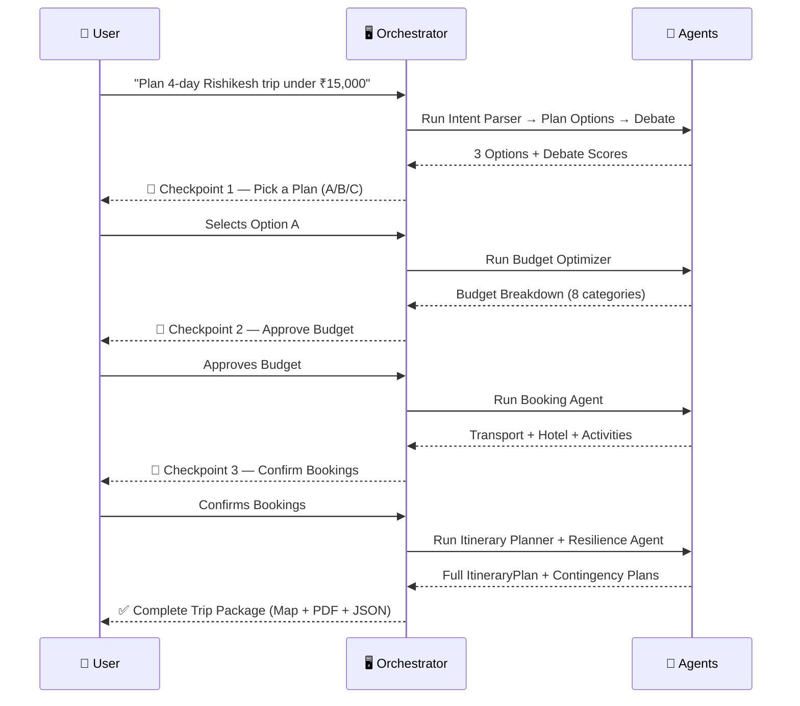
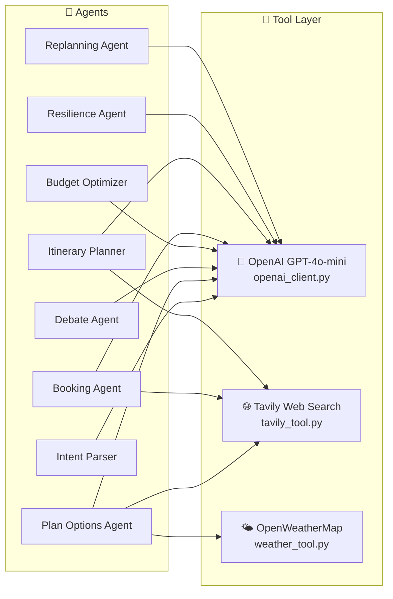
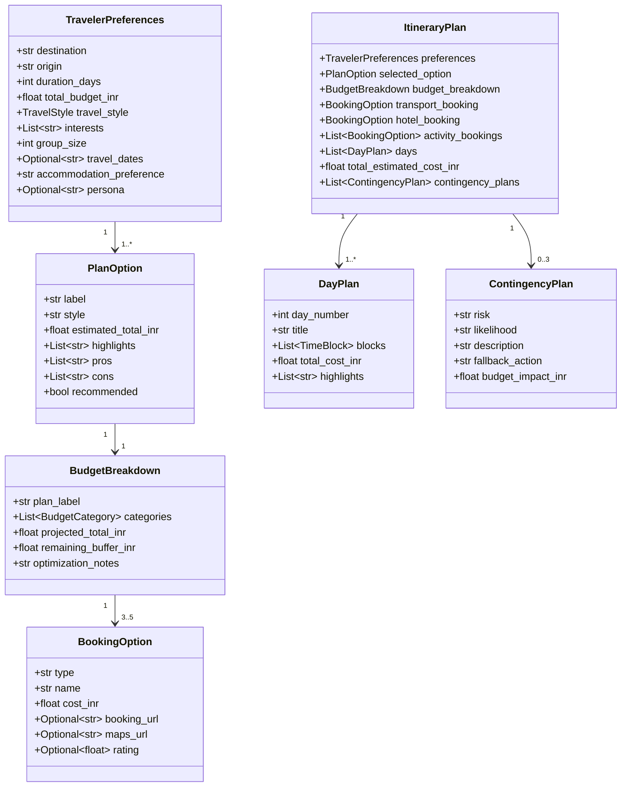
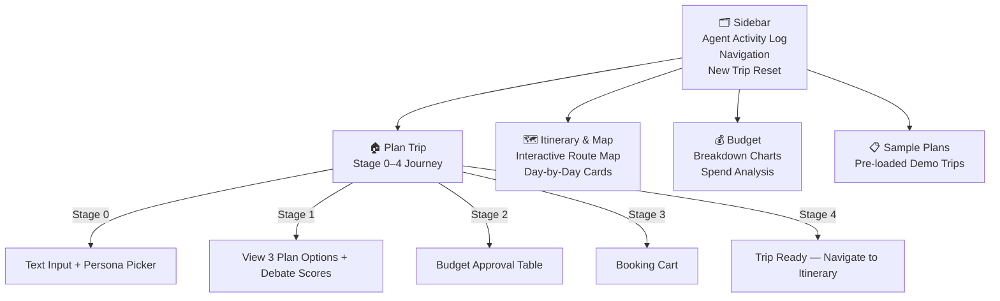

# ✈️ AI Travel Agent — System Architecture

> **Multi-Agent Agentic Workflow for Intelligent Trip Planning**  
> Built with Python · Streamlit · OpenAI GPT-4o-mini · Tavily · OpenWeatherMap

---

## 🗺️ High-Level System Flow



---

## 🏗️ Project Structure

```
travel_agent/
├── app.py                    # Main Streamlit UI & Orchestrator
├── agents/
│   ├── intent_parser.py      # Agent 1 – NL → Structured Preferences
│   ├── plan_options_agent.py # Agent 2 – Generate 3 Plan Options
│   ├── debate_agent.py       # Agent 3 – Score & Rank Plans
│   ├── budget_optimizer.py   # Agent 4 – Budget Allocation
│   ├── booking_agent.py      # Agent 5 – Find Bookable Options
│   ├── itinerary_planner.py  # Agent 6 – Day-by-Day Itinerary
│   ├── resilience_agent.py   # Agent 7 – Contingency Plans
│   └── replanning_agent.py   # Agent 8 – Dynamic Re-planning
├── tools/
│   ├── openai_client.py      # LLM Gateway (GPT-4o-mini)
│   ├── tavily_tool.py        # Live Web Search Tool
│   └── weather_tool.py       # Weather Data Tool
├── models/
│   └── schemas.py            # Pydantic Data Models
└── ui/
    ├── map_view.py            # Interactive Map (Folium)
    └── pdf_export.py         # PDF Generation (FPDF2)
```

---

## 🤖 Agent Responsibilities

| # | Agent | Role | Key Inputs | Key Outputs |
|---|-------|------|-----------|-------------|
| 1 | **Intent Parser** | Parses free-text → structured data | Natural language query | `TravelerPreferences` object |
| 2 | **Plan Options Agent** | Creates 3 distinct trip options | Preferences + Web/Weather data | 3× `PlanOption` (A/B/C) |
| 3 | **Debate Agent** | Scores options on 5 axes | 3 Plan Options | Scores + reasoning per axis |
| 4 | **Budget Optimizer** | Allocates budget intelligently | Selected option + budget | `BudgetBreakdown` with 8 categories |
| 5 | **Booking Agent** | Finds real bookable options | Budget + preferences | Transport, Hotel, Activities |
| 6 | **Itinerary Planner** | Builds day-by-day schedule | All booking details | `ItineraryPlan` with `DayPlan[]` |
| 7 | **Resilience Agent** | Anticipates what could go wrong | Finalized itinerary | 3× `ContingencyPlan` |
| 8 | **Replanning Agent** | Handles mid-trip changes | Itinerary + change request | Updated `DayPlan[]` |

---

## 🔁 Human-in-the-Loop (HITL) Checkpoints



---

## 🧰 Tools & External APIs



---

## 📦 Data Models (Pydantic Schemas)



---

## 🎭 Traveler Personas

The system supports 4 personas that shape every agent's decision:

| Persona | Focus | Budget Style | Activities |
|---------|-------|-------------|------------|
| 🎒 **Backpacker** | Max experiences per ₹ | Dormitory / hostels | Free activities, street food |
| 👨‍👩‍👧 **Family** | Safe & kid-friendly | Comfortable hotels | Easy activities, meal breaks |
| 🏔️ **Adrenaline Junkie** | High-intensity adventure | Any | Rafting, trekking, paragliding |
| 🧘 **Spiritual Seeker** | Inner peace | Ashrams / budget | Yoga, temples, meditation |

---

## 🖥️ UI Pages & Navigation



---

## ⚙️ Technology Stack

| Layer | Technology |
|-------|-----------|
| **Frontend / UI** | Streamlit (Python) |
| **LLM / AI Core** | OpenAI GPT-4o-mini |
| **Web Search** | Tavily Search API |
| **Weather** | OpenWeatherMap API |
| **Maps** | Folium + streamlit-folium |
| **Data Validation** | Pydantic v2 |
| **PDF Export** | FPDF2 |
| **Charts** | Plotly |
| **Environment** | python-dotenv |

---

## 🔄 Key Design Principles

1. **Agentic Workflow** — Each agent has a single responsibility and a structured JSON output
2. **Human-in-the-Loop (HITL)** — 3 explicit checkpoints where the user reviews and approves
3. **Graceful Fallbacks** — Every agent has a hardcoded fallback if LLM parsing fails
4. **Persona-Aware** — Traveler persona propagates through all agents from intent to itinerary
5. **Live Grounding** — Tavily web search and weather data reduce hallucinations
6. **Resilience First** — A dedicated agent proactively identifies risks and pre-generates Plan B options
7. **Dynamic Replanning** — Supports mid-trip itinerary changes without restarting the full pipeline
